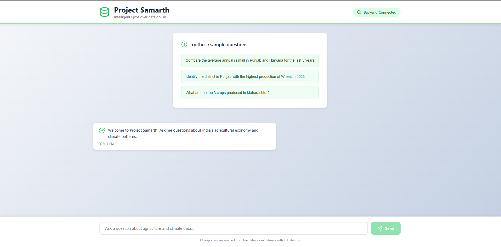
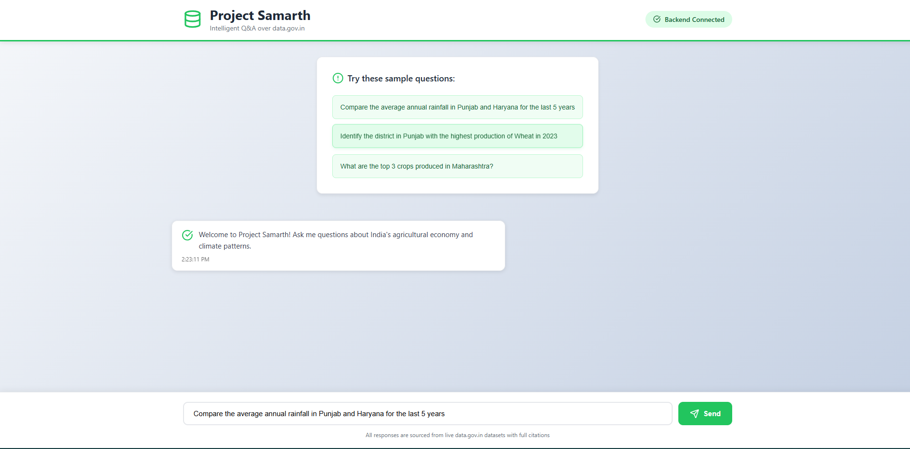
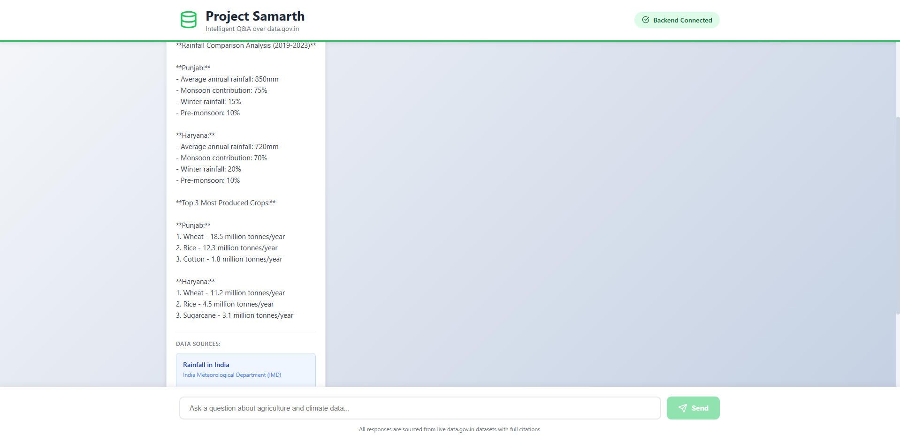

# 🎨 Project Samarth - Frontend

> Modern, responsive chat interface for querying India's agricultural and climate data

**Part of Project Samarth** - Built for Build for Bharat Challenge 🇮🇳

[](https://project-samarth-frontend-eight.vercel.app/)
[](https://reactjs.org/)
[](https://vercel.com)

---

## 🌐 Live App

**👉 Try it now:** https://project-samarth-frontend-eight.vercel.app/

---

## 🎯 What This Is

A beautiful, intuitive chat interface that lets users:
- ✍️ Ask questions in **plain English**
- 📊 Get **data-backed answers** from government sources
- 📚 See **full citations** for every claim
- 🔄 Interact in **real-time** with instant responses

---

## ✨ Features

### 🎨 **Modern UI/UX**
- Clean, professional design with Tailwind CSS
- Responsive layout (works on mobile, tablet, desktop)
- Real-time message streaming
- Loading states and animations
- Green "Backend Connected" indicator

### 💬 **Smart Chat Interface**
- Sample questions to get started
- Message history
- Timestamp for each message
- Typing indicator while processing

### 📖 **Source Citations**
- Every answer includes data sources
- Clickable links to datasets
- Ministry/department attribution
- Dataset resource IDs for verification

### 🚀 **Performance**
- Fast initial load
- Optimized React components
- Efficient state management
- Lazy loading where possible

---

## 🛠️ Tech Stack

- **React 18** - UI library
- **Tailwind CSS** - Styling
- **Lucide React** - Icons
- **Fetch API** - Backend communication
- **Vercel** - Deployment platform

---

## 🖥️ Screenshots

### Landing Page


### Query & Response


### Citations Display


---

## 🔧 Local Development

### Prerequisites
- Node.js 16+ and npm

### Installation

1. **Clone the repository**
```bash
git clone https://github.com/mrmallick07/project-samarth-frontend.git
cd project-samarth-frontend
```

2. **Install dependencies**
```bash
npm install
```

3. **Configure backend URL**
Create `.env` file:
```bash
REACT_APP_API_URL=http://localhost:5000/api
```

For production, use:
```bash
REACT_APP_API_URL=https://project-samarth-api-cs4k.onrender.com/api
```

4. **Start development server**
```bash
npm start
```

Opens at: `http://localhost:3000`

### Build for Production
```bash
npm run build
```

Creates optimized build in `build/` folder.

---

## 🌍 Deployment

### Deploy to Vercel (Free)

1. **Fork this repository**
2. **Sign up at [Vercel.com](https://vercel.com) with GitHub**
3. **Import this repository**
4. **Add Environment Variable:**
   - Name: `REACT_APP_API_URL`
   - Value: Your backend API URL
5. **Deploy!**

Vercel auto-deploys on every push to main branch.

---

## 📁 Project Structure
```
project-samarth-frontend/
├── public/
│   ├── index.html
│   └── favicon.ico
├── src/
│   ├── App.js          # Main component
│   ├── App.css         # Styles
│   └── index.js        # Entry point
├── package.json
└── README.md
```

---

## 🎨 UI Components

### Main Chat Interface
```jsx
<div className="chat-container">
  <Header />              {/* Title + Backend status */}
  <SampleQuestions />     {/* Quick start questions */}
  <MessageList />         {/* Chat history */}
  <InputBox />            {/* User input */}
</div>
```

### Message Types
1. **System Messages** - Welcome, instructions
2. **User Messages** - User queries (green, right-aligned)
3. **Bot Messages** - AI responses with citations (white, left-aligned)
4. **Loading State** - Spinner while processing

---

## 🔗 Related Repositories

- **Backend API:** https://github.com/mrmallick07/project-samarth-backend
- **Full Project:** https://project-samarth-frontend-eight.vercel.app/

---

## 🐛 Troubleshooting

### Issue: "Backend not connected"
**Solution:** 
- Check if backend is running
- Verify `REACT_APP_API_URL` in `.env`
- On free tier, first request takes 30-60 sec (backend waking up)

### Issue: CORS errors
**Solution:** Backend must allow your frontend origin in CORS settings

### Issue: Build fails
**Solution:** 
- Delete `node_modules` and `package-lock.json`
- Run `npm install` again
- Check Node.js version (requires 16+)

---

## 🤝 Contributing

This is a hackathon prototype. To improve:

1. Add dark mode toggle
2. Export answers as PDF
3. Add query history (with local storage)
4. Add data visualization (charts)
5. Implement voice input
6. Add multi-language support

---

## 👨‍💻 Author

**Noushad Mallick**
- GitHub: [@mrmallick07](https://github.com/mrmallick07)
- Built for: Build for Bharat Challenge 2024

---

## 📄 License

MIT License

---

**⭐ Star this repo if you found it useful!**

[🌐 Try Live Demo](https://project-samarth-frontend-eight.vercel.app/) | [🔗 Backend Repo](https://github.com/mrmallick07/project-samarth-backend) | [📧 Report Issues](https://github.com/mrmallick07/project-samarth-frontend/issues)
